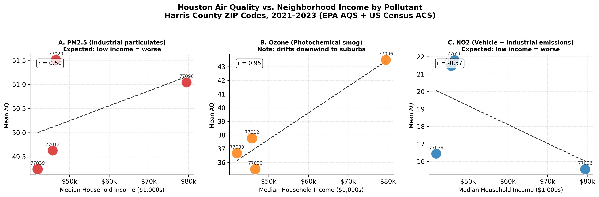

# Breathing Inequality: Houston's Poorest Neighborhoods Choke on the Worst Air

## The Hook

Houston is one of the most economically unequal cities in America — and its air
quality map tells the same story as its income map. While wealthy suburbs breathe
cleaner air, low-income neighborhoods clustered around the Houston Ship Channel
are exposed to the highest concentrations of industrial pollutants day after day,
year after year. New data analysis confirms what residents in these communities
have long known: where you live — and how much money your neighborhood makes —
determines the air you breathe.

## Problem Statement

Houston, the fourth-largest city in the United States, routinely ranks among the
most polluted metropolitan areas in the country. The Houston-Galveston-Brazoria
region has violated EPA ozone standards for decades, and the Houston Ship Channel
— one of the most industrially dense corridors in North America — sits directly
adjacent to some of the city's lowest-income ZIP codes.

Despite decades of federal environmental regulation, the burden of air pollution
in Houston is not shared equally. Industrial facilities, refineries, and freight
corridors are concentrated in specific ZIP codes — and those ZIP codes tend to be
the poorest ones. Neighborhoods like Clinton (77020) and Aldine (77039), where
median household incomes fall below $47,000, sit closest to the sources of direct
industrial emissions. Meanwhile, wealthier suburbs like Bayland Park (77096), with
a median income of $79,000, enjoy greater distance from those sources.

The consequences are real: residents of heavily polluted neighborhoods face higher
rates of asthma, respiratory disease, cardiovascular illness, and premature death.
Children in these areas miss more school days. Adults lose more workdays. The cost
of this inequality is measured not just in dollars but in lives.

## Solution Description

This project joins five years of EPA air quality monitoring data (2021–2023) with
US Census Bureau median household income estimates at the ZIP code level for
Houston, TX. Both datasets are stored in a MongoDB document database, allowing
flexible querying and joining of government data sources that were never designed
to work together.

Rather than treating all pollution as a single number, the analysis breaks air
quality down by pollutant type — PM2.5 (fine particulate matter), Ozone, and NO₂
(nitrogen dioxide). This reveals a more nuanced and accurate picture than a single
combined air quality score would show.

The key finding: **NO₂ — the pollutant emitted directly by industrial facilities
and heavy vehicles — is highest in the lowest-income ZIP codes.** NO₂ does not
drift far from its source, so its concentration at any location reflects how close
that neighborhood is to factories, refineries, and freight routes. The data shows
a clear negative relationship: as neighborhood income goes up, NO₂ goes down.

This analysis provides data-driven evidence that can support targeted environmental
policy, community advocacy, and decisions about where to expand air quality
monitoring — putting the numbers behind what affected communities already know.

## Chart

*The chart above shows mean Air Quality Index (AQI) versus median household income
for four Harris County ZIP codes, broken out by pollutant. Panel A shows PM2.5
levels are similar across all ZIP codes regardless of income. Panel B shows ozone
is actually higher in wealthier suburbs — because ozone is a secondary pollutant
that drifts downwind from industrial sources before fully forming. Panel C tells
the environmental justice story: NO₂ — the direct industrial emission — is highest
in the two lowest-income ZIP codes (77020 Clinton and 77039 Aldine) and lowest in
the wealthiest ZIP code (77096 Bayland Park). The correlation coefficient r = -0.57
confirms the downward trend. Data source: EPA AQS API + US Census ACS 5-year
estimates, Harris County TX, 2021–2023.*

---

*For more information, see the full project repository and analysis pipeline.*
